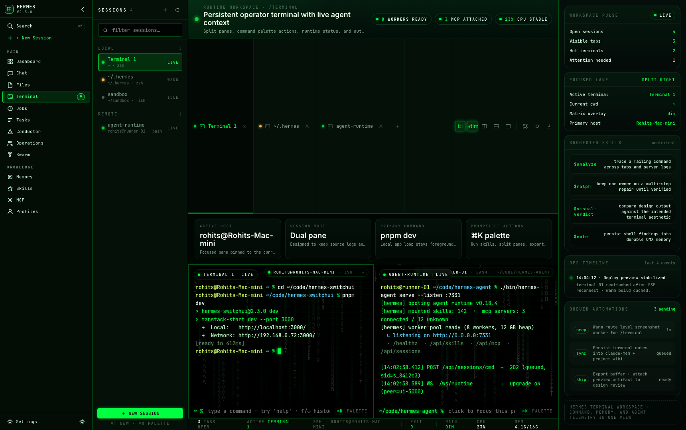

<div align="center">


# Hermes SwitchUI

**A stunning Matrix-themed web interface for your local AI agent. Chat, manage files, run terminals, orchestrate agents, and ship faster — all from your browser, all on your own machine.**

[](LICENSE)
[](https://nodejs.org/)
[](#-switch-ui-specifics)

> A Matrix-styled frontend for the [Hermes Agent](https://github.com/Interstellar-code/hermes-agent) — a powerful local AI runtime with 8 custom plugins. Everything runs locally. No cloud, no subscriptions, full control.



<table>
  <tr>
    <td width="50%" align="center"></td>
    <td width="50%" align="center"></td>
  </tr>
  <tr>
    <td align="center"><sub><b>Dashboard</b> — token usage, sessions, agent health at a glance</sub></td>
    <td align="center"><sub><b>Skills</b> — browse and manage the agent's installed skills</sub></td>
  </tr>
  <tr>
    <td width="50%" align="center"></td>
    <td width="50%" align="center"></td>
  </tr>
  <tr>
    <td align="center"><sub><b>Memory</b> — inspect and edit what the agent remembers</sub></td>
    <td align="center"><sub><b>Conductor</b> — mission control for multi-agent coordination</sub></td>
  </tr>
</table>

</div>

---

## 🟢 Fork & credits

**Switch UI is a fork of [outsourc-e/hermes-workspace](https://github.com/outsourc-e/hermes-workspace).** We diverged for design direction — Matrix aesthetic as the canonical theme, Switch-specific composer/sidebar/meta flows, opinionated UX choices that we don't intend to upstream.

- **Upstream:** [`outsourc-e/hermes-workspace`](https://github.com/outsourc-e/hermes-workspace) — original Hermes Workspace
- **This fork:** [`Interstellar-code/hermes-switchui`](https://github.com/Interstellar-code/hermes-switchui) — Switch UI

**Sync strategy:** we cherry-pick upstream backend/infra fixes when relevant. We do **not** rebase or merge from upstream `main` — UI changes don't flow back, and we avoid pulling upstream UI changes that conflict with the Switch UI direction. Full credit to outsourc-e and the Hermes Switch UI community for the original work this is built on.

---

## ✨ What's different from upstream

| Area | Switch UI | Upstream |
|---|---|---|
| **Theme** | Matrix (default), Claude Nous, Claude Official, Claude Classic, Claude Slate | Hermes / Nous / Bronze / Slate / Mono |
| **Sessions sidebar** | Unified feed across chat / cron / api / task sources, day-grouped, live source filter chips, persisted collapse | Single chat-only list |
| **Composer** | Matrix-themed popovers (workspace, model, profile, thinking-level), green-glow focus border, transparent outer wrapper | Standard wrapper with backdrop blur |
| **Meta bar** | Live tok/s, model, ctx %, tool count, profile, session ID — wired to gateway + derived locally | Different layout |
| **Provider config** | `manifest` provider entry (not `custom`) for Switch-specific endpoints | Standard custom provider |
| **Typography** | Matrix design system tokens (`.m-mono`, `.m-label`, `.m-chip`, `.m-timestamp`) — JetBrains Mono throughout | Mixed sans / mono per surface |
| **Cherry-pick policy** | Backend/infra only from upstream | — |
| **Agent profiles** | 9-step profile wizard with persona prefill, toolsets, C-suite personas, edit mode | None |
| **Chat clarify** | Interactive mid-turn clarify cards | None |
| **Kanban** | Boards + tasks + board templates with 5-step wizard | None / basic |
| **Self-improve** | Full self-improvement lifecycle dashboard | None |
| **Workflows** | YAML DAG workflow engine + authoring UI | None |
| **Plugin suite** | 8 custom Hermes Agent plugins surfaced in-UI | None |

---

## ⚠️ Issues & roadmap

- **Issues:** filed on this repo's [issues tab](https://github.com/Interstellar-code/hermes-switchui/issues).
- **Roadmap:** track releases and upcoming work on the [GitHub releases page](https://github.com/Interstellar-code/hermes-switchui/releases).

---

## 🚀 Installation

Three paths — pick the one that matches you:

| Path | Best for | Time |
|---|---|---|
| **🌐 [One-line install](#1-one-line-install-recommended)** | Local dev on macOS/Linux | ~3 min |
| **🔧 [Manual install](#2-manual-install)** | Existing `hermes-agent`, custom setups | ~3 min |
| **🐳 [Docker Compose](#3-docker-compose)** | Self-hosters, home labs | ~2 min |

### Prerequisites

- **Node.js 22+** — [nodejs.org](https://nodejs.org/)
- **pnpm** — `corepack enable` (bundled with Node 22) or see [pnpm.io](https://pnpm.io/installation)
- **git**
- **`hermes-agent`** — installed via its own [installer](https://github.com/Interstellar-code/hermes-agent) (the one-line install does this for you)

> **Security note:** if you bind the UI to a non-loopback address (`HOST=0.0.0.0`, Docker, LAN, Tailscale), set `HERMES_PASSWORD`. The server refuses to start on a non-loopback host without it. See [Security & deployment](#-security--deployment-env-vars).

### 1. One-line install (recommended)

```bash
curl -fsSL https://raw.githubusercontent.com/Interstellar-code/hermes-switchui/main/install.sh | bash
```

The installer checks Node 22 / git / pnpm, installs `hermes-agent` via the Interstellar-code fork installer, clones this repo, sets up `.env`, enables the Hermes API server, and installs dependencies. It's idempotent — safe to re-run. When it finishes:

```bash
cd ~/hermes-switchui
pnpm start:all                     # starts the gateway + dashboard + UI together
```

Open http://localhost:3000. The first-run **onboarding wizard** (in the browser) walks you through picking a provider and entering your API key — no config files to hand-edit.

### 2. Manual install

```bash
# 1) Install the Hermes Agent backend (its own installer)
curl -fsSL https://raw.githubusercontent.com/Interstellar-code/hermes-agent/main/scripts/install.sh | bash
hermes setup                       # pick provider/model interactively

# 2) Enable the API server so Switch UI can reach it
echo 'API_SERVER_ENABLED=true' >> ~/.hermes/.env

# 3) Clone and run Switch UI
git clone https://github.com/Interstellar-code/hermes-switchui.git
cd hermes-switchui
cp .env.example .env
pnpm install
pnpm start:all                     # gateway + dashboard + UI; or `pnpm dev` if they run elsewhere
```

Open http://localhost:3000 and complete onboarding. If you point Switch UI at a backend that exposes Hermes Agent gateway APIs, enhanced features (sessions, memory, skills, jobs) unlock automatically. Already running `hermes-agent`? See [Attach to existing `hermes-agent`](#already-running-hermes-agent-attach-switch-ui-to-it).

### 3. Docker Compose

```bash
git clone https://github.com/Interstellar-code/hermes-switchui.git
cd hermes-switchui
cp .env.example .env
# Set HERMES_PASSWORD (required — the container binds 0.0.0.0 internally)
docker compose up
```

Open http://localhost:3000.

> **What's in the image:** the published `ghcr.io/interstellar-code/hermes-switchui` image is **self-contained** — it bundles the upstream Hermes Agent *and* the Switch UI under one s6-supervised container. The agent gateway runs inside the container and the UI connects to it over `http://127.0.0.1:8642`. You do **not** need to run `hermes-agent` separately for the default Docker path. If you instead want to point the container at an *external* gateway, override `HERMES_API_URL` in `.env`.

See the [full Docker section](#-docker-quickstart) for provider keys, local-model setup, and building from source.

---

### Two backends: gateway + dashboard

Switch UI talks to **two** Hermes Agent processes:

| Process | Port | Powers | Started by |
|---|---|---|---|
| `hermes gateway run` | 8642 | Chat (portable mode) | `pnpm start:all` |
| `hermes dashboard` | 9119 | Sessions, skills, memory, kanban, jobs, config | **you, separately** |

**The dashboard is not optional for the full experience.** Without it, chat works but sessions/skills/memory/kanban/jobs return errors — Switch UI shows a "Limited mode — Hermes dashboard not connected" banner when this happens. Start it headless (it serves the management APIs; you don't need its own browser UI):

```bash
hermes dashboard --no-open --skip-build
```

Keep it running in its own terminal, or run it as a background service:

```bash
# Linux (systemd --user)
systemctl --user enable --now --unit hermes-dashboard \
  hermes dashboard --no-open --skip-build     # or write a ~/.config/systemd/user/hermes-dashboard.service unit

# macOS / generic — keep it alive in the background
nohup hermes dashboard --no-open --skip-build >~/.hermes/dashboard.log 2>&1 &

# manage it
hermes dashboard --status   # list running dashboard processes
hermes dashboard --stop     # stop them
```

> `hermes dashboard` has no native `install` service command (unlike `hermes gateway install`). On Linux, write a `systemd --user` unit; on macOS, a launchd plist or `nohup`. On loopback (default `127.0.0.1:9119`) Switch UI auto-handles the dashboard's session token — no manual token needed.

### Run as a background service (always-on)

`pnpm start:all` runs the gateway in the foreground — great for trying things out, gone when you close the terminal. To keep Hermes running across reboots, install the gateway as a native OS service:

```bash
hermes gateway install     # Linux: systemd · macOS: launchd
hermes gateway start
```

Then you only need to launch the UI:

```bash
cd ~/hermes-switchui
pnpm dev                   # gateway already running as a service
```

Manage the service with:

```bash
hermes gateway status      # is it running?
hermes gateway restart     # after changing provider/config in ~/.hermes
hermes gateway stop
hermes gateway uninstall   # remove the service
```

> **WSL caveat:** WSL does not ship systemd by default, so `hermes gateway install` may fail there. On WSL (and Docker/Termux), run the gateway in the foreground with `pnpm start:all` or `hermes gateway run` instead.

> **Tip:** the gateway only reads `~/.hermes/config.yaml` at startup. After changing your provider or API key (in the onboarding wizard or by hand), run `hermes gateway restart` for it to take effect.

---

### Already running `hermes-agent`? Attach Switch UI to it

If you already have `hermes-agent` running on `http://<host>:8642`, point Switch UI at it:

```bash
git clone https://github.com/Interstellar-code/hermes-switchui.git
cd hermes-switchui
pnpm install
cp .env.example .env

echo 'HERMES_API_URL=http://127.0.0.1:8642'    >> .env
echo 'HERMES_DASHBOARD_URL=http://127.0.0.1:9119' >> .env

# If your gateway was started with API_SERVER_KEY (auth enabled), set the same value:
# echo 'HERMES_API_TOKEN=***' >> .env

pnpm dev                           # http://localhost:3000 (override with PORT=4000 pnpm dev)
```

Requirements on the agent side:

- Gateway bound to a reachable address (typically `API_SERVER_HOST=0.0.0.0` + the port exposed)
- `API_SERVER_ENABLED=true` in `~/.hermes/.env`
- `hermes dashboard` running (default `http://127.0.0.1:9119`) for sessions, skills, jobs, config APIs
- If `API_SERVER_KEY` is set, pass the same value via `HERMES_API_TOKEN`

Verify before opening Switch UI:

- `curl http://127.0.0.1:8642/health` — gateway ok
- `curl http://127.0.0.1:9119/api/status` — dashboard metadata

#### Running on a remote host (Tailscale / VPN / LAN)

If Switch UI lives on one machine and you access it from another, point `HERMES_API_URL` at the **reachable** backend address, not `127.0.0.1`:

```bash
echo 'HERMES_API_URL=http://100.x.y.z:8642' >> .env
echo 'HERMES_DASHBOARD_URL=http://100.x.y.z:9119' >> .env

# Tell the gateway to listen on all interfaces so peers can reach it:
echo 'API_SERVER_HOST=0.0.0.0' >> ~/.hermes/.env
```

Restart the gateway, dashboard, and Switch UI. Both `HERMES_API_URL` and `HERMES_DASHBOARD_URL` must be reachable URLs — setting only one leaves the other probing `127.0.0.1` and failing.

You can also update both URLs from `Settings → Connection` without restarting. Values persist to `~/.hermes/workspace-overrides.json` and gateway capabilities are reprobed on save.

---

### Manual install

Switch UI works with any OpenAI-compatible backend. If your backend also exposes Hermes Agent gateway APIs, enhanced features (sessions, memory, skills, jobs) unlock automatically.

#### Prerequisites

- **Node.js 22+** — [nodejs.org](https://nodejs.org/)
- **An OpenAI-compatible backend** — local, self-hosted, or remote
- **Optional:** Python 3.11+ if you want to run a Hermes Agent gateway locally

#### Step 1: Start your backend

Switch UI talks to any backend that supports:

- `POST /v1/chat/completions`
- `GET /v1/models` recommended

Example Hermes Agent setup (from scratch):

```bash
curl -fsSL https://raw.githubusercontent.com/Interstellar-code/hermes-agent/main/scripts/install.sh | bash
hermes setup
hermes gateway run
```

If you're using another OpenAI-compatible server, just note its base URL.

#### Step 2: Install & run Switch UI

```bash
git clone https://github.com/Interstellar-code/hermes-switchui.git
cd hermes-switchui
pnpm install
cp .env.example .env
printf '\nHERMES_API_URL=http://127.0.0.1:8642\n' >> .env
pnpm dev                           # http://localhost:3000
```

> **Verify:** open `http://localhost:3000` and complete onboarding. Connect the backend, verify chat works. If your gateway exposes Hermes Agent APIs, advanced features appear automatically.

#### Environment variables

```env
# OpenAI-compatible backend URL
HERMES_API_URL=http://127.0.0.1:8642

# Optional: provider keys the Hermes Agent gateway can read at runtime.
# ANTHROPIC_API_KEY=***
# OPENAI_API_KEY=sk-...
# OPENROUTER_API_KEY=sk-or-v1-...
# GOOGLE_API_KEY=AIza...
# (Ollama / LM Studio / local servers don't need a key)

# Optional: password-protect the web UI
# HERMES_PASSWORD=your_password
```

---

## 🧠 Local models (Ollama, Atomic Chat, LM Studio, vLLM)

Switch UI supports two modes with local models:

### Portable mode (easiest)

Point at your local server — no Hermes Agent gateway needed.

```bash
# Atomic Chat
HERMES_API_URL=http://127.0.0.1:1337/v1 pnpm dev

# Ollama
OLLAMA_ORIGINS=* ollama serve
HERMES_API_URL=http://127.0.0.1:11434 pnpm dev
```

Chat works immediately. Sessions, memory, and skills show "Not Available" — that's expected in portable mode.

### Enhanced mode (full features)

Route through the Hermes Agent gateway for sessions, memory, skills, jobs, and tools.

Two explicit `~/.hermes/config.yaml` examples:

**Atomic Chat**

```yaml
provider: atomic-chat
model: your-model-name
custom_providers:
  - name: atomic-chat
    base_url: http://127.0.0.1:1337/v1
    api_key: atomic-chat
    api_mode: chat_completions
```

**Ollama**

```yaml
provider: ollama
model: qwen3:32b
custom_providers:
  - name: ollama
    base_url: http://127.0.0.1:11434/v1
    api_key: ollama
    api_mode: chat_completions
```

You can adapt the same shape for other OpenAI-compatible local runners. Atomic Chat and Ollama are the two built-in local paths documented in the Switch UI.

**Enable the API server in `~/.hermes/.env`:**

```env
API_SERVER_ENABLED=true
```

**Start the gateway, dashboard, and Switch UI:**

```bash
hermes gateway run         # core APIs on :8642
hermes dashboard           # dashboard APIs on :9119
HERMES_API_URL=http://127.0.0.1:8642 \
HERMES_DASHBOARD_URL=http://127.0.0.1:9119 \
pnpm dev
```

For authenticated gateways, also set `HERMES_API_TOKEN` to the same value as `API_SERVER_KEY`.

> Works with any OpenAI-compatible server — Atomic Chat, Ollama, LM Studio, vLLM, llama.cpp, LocalAI, etc. Just change the `base_url` and `model` in the config above.

---

## 🐳 Docker Quickstart

```bash
git clone https://github.com/Interstellar-code/hermes-switchui.git
cd hermes-switchui
cp .env.example .env
```

Edit `.env` and add at least one LLM provider key:

```env
# ANTHROPIC_API_KEY=***
# OPENAI_API_KEY=sk-...
# OPENROUTER_API_KEY=sk-or-v1-...
# GOOGLE_API_KEY=AIza...
```

Using Ollama, LM Studio, or another local server? No key needed — point the bundled Hermes Agent at your local endpoint via onboarding/config.

Set a UI password before starting the container (required because Docker binds the web server on `0.0.0.0` internally):

```env
HERMES_PASSWORD=change-me-to-a-strong-secret
```

```bash
docker compose up
```

Open `http://localhost:3000` and complete onboarding.

The published image is self-contained: it includes the upstream Hermes Agent plus Switch UI. The agent gateway runs inside the same container and Switch UI connects to it over `http://127.0.0.1:8642`.

To build this self-contained image from local source instead of pulling GHCR:

```bash
docker compose -f docker-compose.yml -f docker-compose.dev.yml up --build
```

---

## 📱 Install as App

Switch UI is a **PWA** — install for the full native experience.

- **Desktop (Chrome / Edge):** click the install icon (⊕) in the address bar at `http://localhost:3000`.
- **iOS Safari:** Share → "Add to Home Screen".
- **Android Chrome:** ⋮ menu → "Add to Home screen".

---

## 📡 Mobile access via Tailscale

Access Switch UI from anywhere on your devices:

1. Install Tailscale on the host and your mobile device — same account on both.
2. `tailscale ip -4` on the host gives you `100.x.x.x`.
3. Open `http://100.x.x.x:3000` on your phone.
4. "Add to Home Screen" for the full app experience.

> Tailscale traffic stays end-to-end encrypted across any network.

---

## 🎨 Switch UI specifics

### Themes

Ten themes across five base palettes — **Matrix** (default), Claude Nous, Claude Official, Claude Classic, Claude Slate — each available in dark and light variants. Applied via `data-theme` on `<html>`. Stored in `localStorage` under `claude-theme`.

### Matrix design system

Tokens live in `src/styles.css` under `[data-theme='matrix']`. Reusable utility classes:

| Class | Use for |
|---|---|
| `.m-mono` | Mono body, paths, inline code, source data |
| `.m-label` | Uppercase tracked caps for headers, sender prefixes, source chips |
| `.m-chip` | Filter pill labels |
| `.m-timestamp` | Mono, tabular-nums, muted — timestamps and metric tails |
| `.m-body` | Chat message body |
| `.m-glow-text` | Green-glow accent text |

Reference mockups in `docs/plans/Hermes-Switchui-Design-Mockups/`.

### Manifest provider

Switch UI uses a named `manifest` provider entry (not `custom` — `custom` is reserved by the gateway and `_get_named_custom_provider` returns `None` for it):

```yaml
model:
  default: auto
  provider: manifest
providers:
  manifest:
    type: openai
    base_url: http://your-endpoint/v1
    key_env: CUSTOM_API_KEY
```

API key stored in `~/.hermes/.env` as `CUSTOM_API_KEY`.

### Unified sessions sidebar

Single feed merging chat, cron, api, and task sources, day-grouped (Pinned / Today / Yesterday / Earlier), with source filter chips, state segments, free-text search, and persisted collapse state.

### Powered by the Hermes Agent plugin suite

Switch UI is a frontend over the [Interstellar-code/hermes-agent](https://github.com/Interstellar-code/hermes-agent) fork, extended by 8 custom plugins that power its features:

| Plugin | Version | What it does |
|---|---|---|
| `matrix_coder` | 0.6.1 | Specialist-coder layer; IntentGate routes requests to 8 roles |
| `workflow-engine` | 0.1.0 | YAML DAG workflows; powers `/workflows` |
| `a2a_fleet` | 0.8.14 | Agent-to-agent fleet; managed repo-scoped executors |
| `mcp_lazy` | 0.2.0 | Lazy MCP schema loading; ~80% MCP token cut |
| `kanban` | 1.0.0 | Collaboration boards, tasks, templates; powers `/tasks`, `/boards`, `/board-templates` |
| `karpathy-self-improve` | 0.1.0 | Self-improvement lifecycle; powers `/self-improve` |
| `personas` | 0.1.0 | Canonical 20-persona store; backs the profile wizard |
| `hermes-switch-ui` | 0.1.0 | Backend awareness + config sync for the UI |

Full plugin documentation: [docs/plugins/](https://interstellar-code.github.io/hermes-switchui/plugins/overview/).

---

## 🔒 Security & deployment env vars

### Built-in safeguards

- Auth middleware on every API route
- CSP headers via meta tags
- Path-traversal prevention on file/memory routes
- Rate limiting on endpoints
- Fail-closed startup guard: refuses to bind non-loopback without `HERMES_PASSWORD`
- Session cookies: `HttpOnly` + `SameSite=Strict` + `Secure` (in production)
- Optional password protection for the web UI

### Env vars for remote / Docker deployments

- `HERMES_PASSWORD` — required whenever `HOST ≠ 127.0.0.1` (legacy `CLAUDE_PASSWORD` still honored)
- `COOKIE_SECURE=1` — force `Secure` cookie flag when terminating HTTPS at a proxy
- `COOKIE_SECURE=0` — disable `Secure` flag for plain-HTTP LAN deployments
- `TRUST_PROXY=1` — trust `x-forwarded-for` / `x-real-ip` (only behind a sanitizing reverse proxy)
- `HERMES_DASHBOARD_TOKEN` — explicit bearer for dashboard API
- `HERMES_API_TOKEN` — bearer for the Hermes Agent gateway when started with `API_SERVER_KEY`
- `HERMES_ALLOW_INSECURE_REMOTE=1` — bypass the fail-closed guard (not recommended)

See `.env.example` for the full list.

---

## 🔧 Troubleshooting

### "Switch UI loads but chat doesn't work"

Switch UI auto-detects the gateway's capabilities on startup. Look in your terminal for:

```
[gateway] http://127.0.0.1:8642 available: health, models; missing: sessions, skills, memory, config, jobs
```

**Fix:** upgrade to the latest stock `hermes-agent`:

```bash
cd ~/hermes-agent && git pull && uv pip install -e .
hermes gateway run
```

### "Connection refused" or hangs on load

Gateway isn't running:

```bash
hermes gateway run
```

First time? Run `hermes setup` first to pick a provider and model.

### Ollama: chat returns empty / model shows "Offline"

`~/.hermes/config.yaml` needs the `custom_providers` section and `API_SERVER_ENABLED=true` in `~/.hermes/.env`. See [Local Models](#-local-models-ollama-atomic-chat-lm-studio-vllm) above.

Ensure Ollama runs with CORS enabled and use `http://127.0.0.1:11434/v1` (not `localhost`):

```bash
OLLAMA_ORIGINS=* ollama serve
```

Verify: `curl http://localhost:8642/health`.

---

## 🤝 Contributing

This fork is small and opinionated. PRs are welcome, but coordinate before non-trivial changes:

- **Bug fixes:** open a PR directly
- **New features / UI changes:** open an issue first to discuss
- **Backend / infra fixes that benefit upstream too:** consider sending the upstream PR to [`outsourc-e/hermes-workspace`](https://github.com/outsourc-e/hermes-workspace) — we'll cherry-pick once it lands
- **Security issues:** see [SECURITY.md](SECURITY.md)

---

## 📄 License

MIT — see [LICENSE](LICENSE). Inherited from upstream `outsourc-e/hermes-workspace`.

---

<div align="center">
  <sub>Switch UI — a Matrix-styled fork of <a href="https://github.com/outsourc-e/hermes-workspace">outsourc-e/hermes-workspace</a></sub>
</div>
