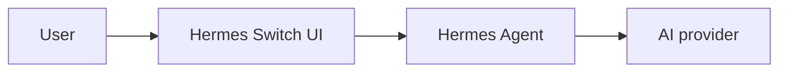
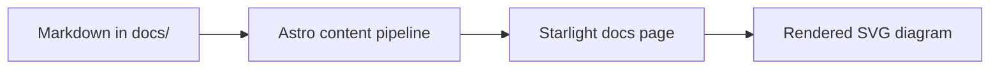

# Authoring docs

> The canonical docs source is the repo-root `docs/` folder. The Switch UI app renders it at `/docs`, and the Astro/Starlight website renders the same markdown at the public website `/docs/...` routes.

<iframe
  src="/api/docs-asset?path=diagrams/docs-authoring-pipeline.html"
  width="100%"
  height="900"
  loading="lazy"
  style="border: 0; border-radius: 8px;"
></iframe>

## How it works

All docs live in `docs/` as plain markdown files. A central manifest — `docs/docs-manifest.yaml` — controls the Switch UI app docs sidebar. The Astro/Starlight website has its own sidebar config in `website/astro.config.mjs`, but it reads the same markdown files from the repo-root `docs/` folder.

There are two render targets for the same source:

- **Switch UI app docs** at `/docs` use the app renderer and keep local app navigation/auth behavior.
- **Website docs** at `/docs/...` on the public website, and `/website/docs/...` in the embedded Switch UI preview, are generated by Astro/Starlight during `website` builds.

Relative markdown links are rewritten for each target so navigation stays inside the active docs surface. Image and HTML diagram assets are also rewritten per target: the app uses `/api/docs-asset?...`; the website build copies assets into `website/public/docs-assets/` and serves them as static `/docs-assets/...` files. Mermaid diagrams render client-side in the website build.

## Adding a new doc

There are three steps: create the file, register it in the manifest, and reload.

### 1. Create the markdown file

Place the file under `docs/`. Use kebab-case filenames. Group related docs into subfolders — `getting-started/`, `chat/`, `pages/`, and so on.

Every doc should start with frontmatter followed by a top-level heading and a lead sentence:

```markdown
---
title: Display title shown in the sidebar
description: One-line summary used as the page subtitle.
---

# Display title

> Lead sentence — what problem this doc solves.

## Section
...
```

The frontmatter `title` is overridden by the manifest's `title:` field if both are set, so you only need one of the two.

### 2. Add it to the manifest

Open `docs/docs-manifest.yaml` and insert your doc in the position you want it to appear in the Switch UI app docs sidebar. Order in the array is the order in the app sidebar. If the page should also appear in the website docs sidebar, add the matching slug to the Starlight `sidebar` config in `website/astro.config.mjs`.

```yaml
pages:
  ...
  - slug: my-section/my-new-doc
    title: My new doc
  ...
```

The slug is the path relative to `docs/` without the `.md` extension. A slug of `getting-started/install` maps to `docs/getting-started/install.md`.

### 3. Reload

The Switch UI dev server picks up manifest changes without a restart. Refresh `/docs` in your browser and your doc appears in the app sidebar. For the website docs, run the website build/dev server so Starlight regenerates its content collection and sidebar.

## Voice and style

Plain language. Active voice. Second person — "You can..." rather than "Users can...".

Keep paragraphs short: two to four sentences. Each paragraph should make one point. If you find yourself writing a long explanatory block, break it into a subsection with a `###` heading.

Use **bold** for UI labels that match what users see on screen: **Settings → Model & Provider**, **Save changes**. Use `code` formatting for file paths, environment variable names, shell commands, and code identifiers. No emojis. No marketing language.

Do not write what you cannot verify. If you are unsure how something works, read the source first or leave a `> [TODO: verify this]` note rather than guessing.

## Linking between docs

Use standard relative markdown links that point at the `.md` file:

```markdown
See [Your first chat](first-chat.md).
See [Agent won't connect](../troubleshooting/agent-connect.md).
```

Each renderer rewrites these links for its own surface: the app keeps navigation inside `/docs`, while the website keeps navigation under `/docs/...` (or `/website/docs/...` when embedded in Switch UI). Do not write absolute `/docs/...` URLs by hand unless you intentionally need a hard public URL; relative `.md` links survive slug and base-path changes better.

Anchors work too:

```markdown
[FAQ entry](../faq.md#what-browsers-are-supported)
```

## Images

Put images under `docs/images/` for site-wide assets, or `docs/<section>/images/` for section-specific ones. Reference them with standard markdown image syntax:

```markdown

```

The leading `/` means docs-root-relative. You can also use a path relative to the current file:

```markdown

```

Both forms are rewritten for the active target. In the Switch UI app they go through the authenticated `/api/docs-asset` endpoint. In the Astro/Starlight website build they are copied to `website/public/docs-assets/` and emitted as static `/docs-assets/...` URLs.

Supported formats: `.png`, `.jpg`, `.jpeg`, `.gif`, `.webp`, `.svg`. Video files are also supported: `.mp4`, `.webm`.

### Screenshots not yet captured

For a screenshot you plan to add later, use a placeholder blockquote:

```markdown
> [SCREENSHOT: chat composer at rest, matrix-dark theme]
```

This renders as a visible callout. When you capture the image, replace the line with a normal image reference. Keep a running list of pending screenshots in `docs/_screenshot-index.md` — that file is internal (not in the manifest) and never appears in the rendered site.

## Diagrams (mermaid)

Use a fenced code block with the `mermaid` language tag:

````markdown

```mermaid
graph LR
  A[User] --> B[Hermes Switch UI]
  B --> C[Hermes Agent]
  C --> D[AI provider]
```
````

The website renderer converts these to SVG client-side using the local Mermaid runtime copied into `website/public/vendor/mermaid/`. Mermaid is well-suited to workflow diagrams, architecture overviews, and sequence diagrams. Keep diagrams focused — one concept per diagram.

Rendered example:


```mermaid
graph LR
  A[Markdown in docs/] --> B[Astro content pipeline]
  B --> C[Starlight docs page]
  C --> D[Rendered SVG diagram]
```

### HTML diagrams (architecture)

For richer diagrams — system architecture, infra topology, cloud diagrams — you can embed a standalone HTML file. The Hermes Agent's `architecture-diagram` skill generates dark-themed SVG diagrams as HTML files which you can drop into docs.

Workflow:

1. Ask your agent to generate a diagram using the `architecture-diagram` skill — describe what you want shown (services, layers, connections).
2. Save the resulting `.html` file under `docs/<section>/diagrams/<name>.html` (create a `diagrams/` folder per section).
3. Embed it in your doc via iframe using the app-safe source path:

   ```markdown
   <iframe
     src="/api/docs-asset?path=<section>/diagrams/<name>.html"
     width="100%"
     height="600"
     loading="lazy"
     style="border: 0; border-radius: 8px;"
   ></iframe>
   ```

The app serves these files through `/api/docs-asset` with strict Content-Security-Policy headers. The website build rewrites the same iframe to a static `/docs-assets/<section>/diagrams/<name>.html` URL, adds `sandbox=""`, and keeps the diagram self-contained for public hosting. Keep HTML diagrams static — no scripts.

Use this when:
- Mermaid is too limited (you need precise positioning, custom shapes, brand styling)
- You want a one-page architecture poster
- You have a complex topology that benefits from visual hierarchy

Stick with mermaid for:
- Simple flowcharts and sequence diagrams
- Diagrams that change frequently (mermaid is easier to edit)

## Code blocks

Use fenced code blocks with a language hint for syntax highlighting:

````markdown
```bash
pnpm dev
```
````

Common languages: `bash`, `ts`, `tsx`, `js`, `yaml`, `json`, `python`, `markdown`. Any Shiki-supported language works.

## Numbering and table of contents

The sidebar auto-numbers entries hierarchically (1., 2.1, etc.) based on manifest order. You do not need to write numbers yourself.

The right-hand "On this page" TOC is generated from your `##` and `###` headings. Do not skip heading levels — jumping from `##` to `####` produces a broken TOC hierarchy.

## What not to add

Keep the doc site focused on things that help users understand and use the product. Leave out:

- Internal architectural notes — those belong in design docs or RFCs.
- API reference dumps generated from code — auto-generate those separately if needed.
- Project history or changelog entries — there is a separate changelog process.

## Removing or renaming a doc

To remove a doc, delete its entry from `docs-manifest.yaml`. The `.md` file can stay on disk if you want to keep it for internal reference — it will not render.

To rename a slug, update the manifest entry and then grep the `docs/` folder for the old slug to update any inbound links from other docs.

## Internal helper files

Files with a `_` prefix — for example `_screenshot-index.md` or `_shared-terms.md` — are internal references for doc authors. They are never added to the manifest and never appear in the rendered site.

## Related

- [Welcome](../welcome.md)
- [Your first chat](first-chat.md)
- [Connecting your AI provider](connecting-provider.md)
